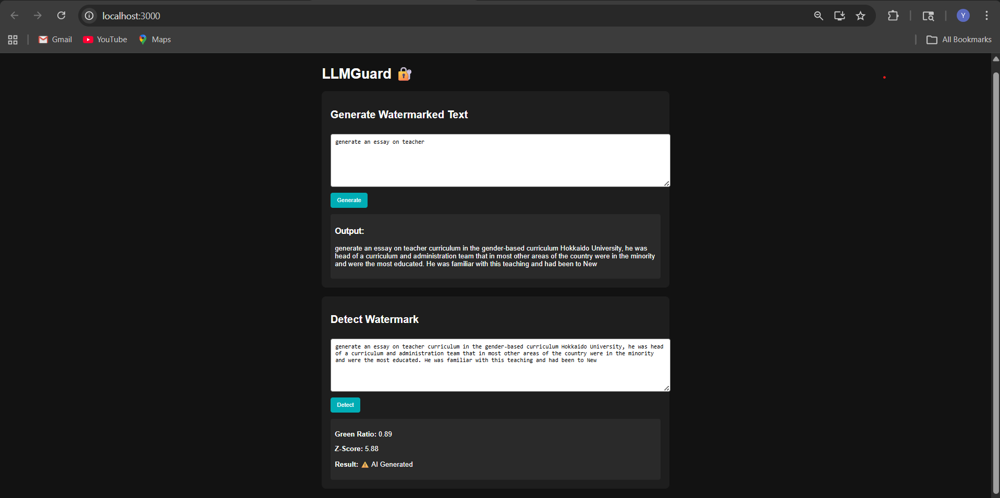

# 🔐 LLMGuard – AI Watermarking & Detection System

LLMGuard is a full-stack system that **embeds and detects watermarks in AI-generated text** using statistical techniques. It demonstrates how large language models can be made traceable by introducing controlled bias during token generation and identifying it later through analysis.

---

## 🚀 Features

* ✍️ **Watermarked Text Generation** using GPT-2
* 🔍 **AI Detection Engine** based on statistical bias (Green Token Ratio + Z-score)
* 🧠 **Deterministic Watermarking** using cryptographic hashing (SHA256)
* ⚡ **Low-latency API** with Flask backend
* 🌐 **Interactive Frontend** built with React
* 📊 **Confidence Score & Metadata** for detection results

---

## 🖼️ UI Preview

<p align="center">
  
</p>

---

## 🧠 How It Works

### 🔹 Watermark Embedding

During text generation:

* Vocabulary is split into **Green** and **Red** tokens using a secret key
* The model is biased to prefer **Green tokens**
* This creates a hidden statistical pattern

### 🔹 Detection

Given a text:

* Tokens are reclassified using the same secret key
* The system computes:

  * **Green Token Ratio**
  * **Z-score (statistical deviation)**
* If deviation is high → ⚠️ AI Generated

---

## 🏗️ Architecture

```
Frontend (React)
       ↓
Flask API (api.py)
   ↓        ↓
Generator   Detector
   ↓            ↓
Watermark Logic (SHA256-based)
```

---

## 🛠️ Tech Stack

### Backend:

* Python
* Flask
* NumPy
* PyTorch
* Hugging Face Transformers

### Frontend:

* React.js
* Axios

---

## 📁 Project Structure

```
llmguard/
│
├── backend/
│   ├── api.py
│   ├── generator.py
│   ├── detector.py
│   ├── watermark.py
│   ├── utils.py
│   └── requirements.txt
│
└── frontend/
    ├── src/
    ├── public/
    └── package.json
```

---

## ⚙️ Installation & Setup

### 🔹 Backend Setup

```bash
cd backend
python -m venv venv
venv\Scripts\activate   # Windows
pip install -r requirements.txt
python api.py
```

Backend runs on:

```
http://localhost:5000
```

---

### 🔹 Frontend Setup

```bash
cd frontend
npm install
npm start
```

Frontend runs on:

```
http://localhost:3000
```

---

## 🧪 Usage

### 1. Generate Watermarked Text

* Enter a prompt
* Click **Generate**

### 2. Detect AI Content

* Paste generated text
* Click **Detect**

---

## 📊 Sample Output

```json
{
  "green_ratio": 0.68,
  "z_score": 3.21,
  "confidence": 0.64,
  "is_watermarked": true
}
```

---

## ⚠️ Important Notes

* The system **does NOT detect AI writing style**
* It detects **statistical watermark patterns only**
* External AI text (e.g., ChatGPT output) may not be detected unless watermarked

---

## 🔥 Future Improvements

* 📈 Visualization of token distributions
* 🛡️ Robustness against paraphrasing attacks
* 🤖 Support for larger LLMs (LLaMA, Mistral)
* 🔐 Stronger watermarking schemes (research-based)

---

## 🎯 Use Cases

* AI content verification
* Academic integrity tools
* Content authenticity tracking
* Research in AI safety and security

---

## 🧠 Key Concept

> Watermarking introduces controlled randomness during generation, and detection identifies statistical deviations from natural language patterns.

---

## 🙌 Acknowledgements

Inspired by recent research in **LLM watermarking and AI content detection**.

---

## 📬 Contact

Developed by **Yash Bhate**
Feel free to connect or contribute 🚀
